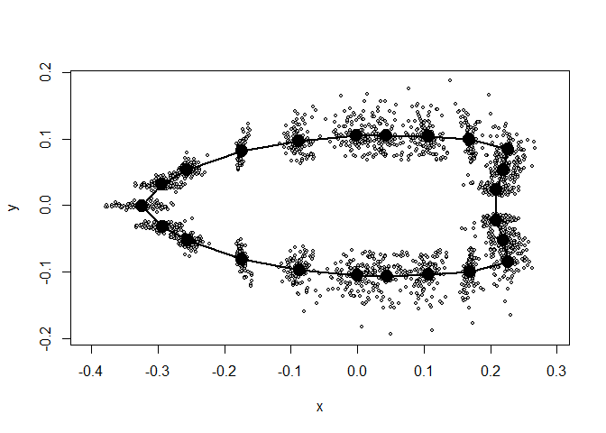

Clovis Allometry
================
David K. Thulman
5/15/2020

This R code creates most of the figures and tables in the Clovis Point
Allometry: Exploring Shape Variation with Landmark-based Geometric
Morphometrics.

It uses two packages beyond the basic R packages: (1) geomorph and (2)
Hmisc. To start, load those packages.

``` r
library(geomorph)
```

    ## Loading required package: RRPP

    ## Loading required package: rgl

``` r
library(Hmisc)
```

    ## Loading required package: lattice

    ## Loading required package: survival

    ## Loading required package: Formula

    ## Loading required package: ggplot2

    ## 
    ## Attaching package: 'Hmisc'

    ## The following objects are masked from 'package:base':
    ## 
    ##     format.pval, units

Now, set the working directory to the GitHub repository:
<https://github.com/dktArcoop/Clovis-Allometry-Files>

``` r
setwd(getwd())
```

The first step is to set up the background files in geomorph. These
first files will be the tps file for the 23 Landmark (LM) configuration,
which is aligned with a GPA and converted into a geomorph dataframe.
Second, a csv file will be uploaded and appended to the dataframe. The
natural logs for several measurements will created in the
dataframe.

``` r
CAP23<-readland.tps("CAP23.tps", specID = "ID") #creates new file with 23LM tps data
```

    ## 
    ## No curves detected; all points appear to be fixed landmarks.

``` r
Z.gpa<-gpagen(CAP23) #Procrustes alignment renamed as Z.gpa
```

    ##   |                                                                              |                                                                      |   0%  |                                                                              |==============                                                        |  20%  |                                                                              |============================                                          |  40%  |                                                                              |======================================================================| 100%

``` r
groups<-read.csv("APF Cache.csv",header=TRUE,stringsAsFactors = TRUE) #reads in the classifier data

CAP23.gdf <- geomorph.data.frame(Z.gpa) #creates a dataframe from the 23LM gpagen output

CAP23.gdf<-append(CAP23.gdf, groups) #appends groups factors to the dataframe created from Z.gpa, keeps same name

CAP23.gdf$lnCZE <- log(CAP23.gdf$Csize) #Creates new column with log of Centroid Size
CAP23.gdf$lnCZS <- log(CAP23.gdf$StemCZ) #Creates new column with log of Blade centroid Size
CAP23.gdf$lnCZB <- log(CAP23.gdf$BladeCZ) #Creates new column with log of Stem Centroid Size
```

Now, the Mean Shape of the data will be created, along with a links file
that connects the LMs. The links file is created with an interactive
function and has been disabled. A previously created links file is
included.

``` r
MS <- mshape(CAP23.gdf$coords) #creates mean shape and labels LMs 
par(mfcol = c(1,1))#sets single-plot option
#EMSL<- define.links(MS) #create a links file named EMSL. Interactive function disabled
EMSL <- read.csv("EMSL.csv")
CAP23.gdf<-append(CAP23.gdf, EMSL) #append the links file EMSL to the dataframe
plot(MS, links=EMSL) #Plots mean shape [Figure 2A]
```

<!-- -->

A plot of the distribution of aligned LMs from the 100 Clovis points is
created.

``` r
plotAllSpecimens(CAP23.gdf$coords, mean=TRUE, plot.param = list(pt.cex=.6), links=EMSL) #Distibution of LMs from all specimens with the links file [Figure 3A]
```

<!-- -->

This plots the reference shape (the mean shape) to one of the larger
Clovis points to illustrate the vector displacement of
LMs.

``` r
plotRefToTarget(MS, CAP23.gdf$coords[,,11], links=EMSL, method="vector") #vector displacement from mean to specimen 11 [Figure 6A]
```

<!-- -->

``` r
#mtext("Vector Displacement") #title disabled
```

This creates a PCA with wiregrid illustrations of points on the max and
min points of PCA1. This was not a figure in the
paper.

``` r
plotTangentSpace(CAP23.gdf$coords, groups=CAP23.gdf$Cache)#creates PCA plot with max and min images on PC1, colors for non-cacke (red) and cache (black)
```

<!-- -->

    ## 
    ## PC Summary
    ## 
    ## Importance of first k=35 (out of 46) components:
    ##                            PC1     PC2     PC3     PC4     PC5      PC6
    ## Standard deviation     0.08441 0.06923 0.01728 0.01202 0.01084 0.008404
    ## Proportion of Variance 0.55997 0.37675 0.02348 0.01135 0.00924 0.005550
    ## Cumulative Proportion  0.55997 0.93672 0.96020 0.97155 0.98079 0.986340
    ##                             PC7      PC8      PC9     PC10    PC11     PC12
    ## Standard deviation     0.006199 0.005897 0.004287 0.003757 0.00363 0.002722
    ## Proportion of Variance 0.003020 0.002730 0.001440 0.001110 0.00104 0.000580
    ## Cumulative Proportion  0.989360 0.992090 0.993530 0.994640 0.99568 0.996260
    ##                            PC13     PC14    PC15     PC16    PC17    PC18
    ## Standard deviation     0.002543 0.002454 0.00233 0.002118 0.00197 0.00184
    ## Proportion of Variance 0.000510 0.000470 0.00043 0.000350 0.00031 0.00027
    ## Cumulative Proportion  0.996770 0.997240 0.99767 0.998020 0.99833 0.99859
    ##                            PC19     PC20     PC21     PC22     PC23     PC24
    ## Standard deviation     0.001665 0.001504 0.001322 0.001279 0.001236 0.001137
    ## Proportion of Variance 0.000220 0.000180 0.000140 0.000130 0.000120 0.000100
    ## Cumulative Proportion  0.998810 0.998990 0.999130 0.999260 0.999380 0.999480
    ##                            PC25      PC26      PC27      PC28      PC29
    ## Standard deviation     0.001086 0.0009883 0.0009075 0.0008293 0.0007607
    ## Proportion of Variance 0.000090 0.0000800 0.0000600 0.0000500 0.0000500
    ## Cumulative Proportion  0.999570 0.9996500 0.9997100 0.9997700 0.9998100
    ##                             PC30      PC31      PC32      PC33      PC34
    ## Standard deviation     0.0006737 0.0006457 0.0005667 0.0005306 0.0004797
    ## Proportion of Variance 0.0000400 0.0000300 0.0000300 0.0000200 0.0000200
    ## Cumulative Proportion  0.9998500 0.9998800 0.9999000 0.9999300 0.9999400
    ##                             PC35
    ## Standard deviation     0.0004238
    ## Proportion of Variance 0.0000100
    ## Cumulative Proportion  0.9999600

The Allometry Analysis. This creates Figure 5.

``` r
attach(CAP23.gdf)
color = rep(NA, length=length(CAP23.gdf$Cache)) #colors cache and non-cache dots in plot
color[which(CAP23.gdf$Cache=="Cache")] = "black"
color[which(CAP23.gdf$Cache=="Other")] = "red"
color #check to determine color designations are correct
```

    ##   [1] "red"   "red"   "red"   "red"   "red"   "red"   "red"   "red"   "red"  
    ##  [10] "red"   "red"   "red"   "red"   "red"   "red"   "red"   "red"   "red"  
    ##  [19] "red"   "red"   "red"   "red"   "red"   "red"   "red"   "black" "black"
    ##  [28] "black" "black" "black" "black" "black" "black" "black" "black" "black"
    ##  [37] "black" "black" "black" "black" "black" "red"   "black" "black" "black"
    ##  [46] "black" "black" "red"   "red"   "red"   "red"   "red"   "red"   "red"  
    ##  [55] "red"   "red"   "red"   "red"   "red"   "red"   "red"   "red"   "red"  
    ##  [64] "red"   "red"   "red"   "red"   "red"   "red"   "red"   "red"   "red"  
    ##  [73] "red"   "red"   "red"   "red"   "red"   "red"   "red"   "red"   "red"  
    ##  [82] "red"   "red"   "red"   "red"   "red"   "red"   "red"   "black" "black"
    ##  [91] "black" "black" "red"   "red"   "red"   "red"   "red"   "red"   "red"  
    ## [100] "red"

``` r
CAP23CS <- procD.lm(coords~ log(Csize), data=CAP23.gdf, iter=10000, RRPP=TRUE, print.progress = FALSE) #names regression of coords on log Centroid size
plotAllometry(CAP23CS, size=CAP23.gdf$lnCZE,  method = "PredLine", col=color, pch=19, bg=CAP23.gdf$Cache, xlab="Ln Centroid Size") #plots the Prediction Line
CAPlnCS <- plotAllometry(CAP23CS, size=CAP23.gdf$lnCZE,  method = "PredLine", col=color, pch=19, bg=CAP23.gdf$Cache, xlab="Ln Centroid Size") #plots the Prediction Line
```

<!-- -->

``` r
#picknplot.shape(CAPlnCS) #creates the small inserts for Figure 4, interaction function disabled
```

Creates the ANOVA results in Table 2 illustrating the presence of
allometry and amount of change (r2) for log normal of the entire, stem,
and base centroid
sizes.

``` r
CAP23CS.anova <- anova(CAP23CS) #calculates the anova of the Clovis Allometry on log Centroid Size. CAP23CS is linear regression object created above
summary(CAP23CS.anova) #summary of the ANOVA results against the null of isometric change
```

    ## 
    ## Analysis of Variance, using Residual Randomization
    ## Permutation procedure: Randomization of null model residuals 
    ## Number of permutations: 10001 
    ## Estimation method: Ordinary Least Squares 
    ## Sums of Squares and Cross-products: Type I 
    ## Effect sizes (Z) based on F distributions
    ## 
    ##            Df      SS      MS     Rsq      F      Z    Pr(>F)    
    ## log(Csize)  1 0.43357 0.43357 0.34423 51.442 4.3802 9.999e-05 ***
    ## Residuals  98 0.82599 0.00843 0.65577                            
    ## Total      99 1.25956                                            
    ## ---
    ## Signif. codes:  0 '***' 0.001 '**' 0.01 '*' 0.05 '.' 0.1 ' ' 1
    ## 
    ## Call: procD.lm(f1 = coords ~ log(Csize), iter = 10000, RRPP = TRUE,  
    ##     data = CAP23.gdf, print.progress = FALSE)

``` r
CAP23SCS <- procD.lm(coords~ lnCZS, data=CAP23.gdf, iter=10000, RRPP=TRUE, print.progress = FALSE) #regression on of entire shape on log stem centroid size. Stem CS calculated below and then included in the "groups.csv" 
CAP23SCS.anova <- anova(CAP23SCS) #calculates the anova 
summary(CAP23SCS.anova) #summary of the ANOVA results against the null of isometric change
```

    ## 
    ## Analysis of Variance, using Residual Randomization
    ## Permutation procedure: Randomization of null model residuals 
    ## Number of permutations: 10001 
    ## Estimation method: Ordinary Least Squares 
    ## Sums of Squares and Cross-products: Type I 
    ## Effect sizes (Z) based on F distributions
    ## 
    ##           Df     SS       MS     Rsq      F      Z    Pr(>F)    
    ## lnCZS      1 0.2386 0.238602 0.18943 22.903 3.5663 9.999e-05 ***
    ## Residuals 98 1.0210 0.010418 0.81057                            
    ## Total     99 1.2596                                             
    ## ---
    ## Signif. codes:  0 '***' 0.001 '**' 0.01 '*' 0.05 '.' 0.1 ' ' 1
    ## 
    ## Call: procD.lm(f1 = coords ~ lnCZS, iter = 10000, RRPP = TRUE, data = CAP23.gdf,  
    ##     print.progress = FALSE)

``` r
CAP23BCS <- procD.lm(coords~ lnCZB, data=CAP23.gdf, iter=10000, RRPP=TRUE, print.progress = FALSE) ##regression on of entire shape on log stem centroid size. Blade CS calculated below and then included in the "groups.csv"
CAP23BCS.anova <- anova(CAP23BCS) #calculates the anova
summary(CAP23BCS.anova) #summary of the ANOVA results against the null of isometric change
```

    ## 
    ## Analysis of Variance, using Residual Randomization
    ## Permutation procedure: Randomization of null model residuals 
    ## Number of permutations: 10001 
    ## Estimation method: Ordinary Least Squares 
    ## Sums of Squares and Cross-products: Type I 
    ## Effect sizes (Z) based on F distributions
    ## 
    ##           Df      SS      MS     Rsq      F      Z    Pr(>F)    
    ## lnCZB      1 0.44757 0.44757 0.35534 54.017 4.4315 9.999e-05 ***
    ## Residuals 98 0.81199 0.00829 0.64466                            
    ## Total     99 1.25956                                            
    ## ---
    ## Signif. codes:  0 '***' 0.001 '**' 0.01 '*' 0.05 '.' 0.1 ' ' 1
    ## 
    ## Call: procD.lm(f1 = coords ~ lnCZB, iter = 10000, RRPP = TRUE, data = CAP23.gdf,  
    ##     print.progress = FALSE)

The Integration
Test

``` r
CAP23.inter <- integration.test(Z.gpa$coords[c(1:4,6:13),,], Z.gpa$coords[c(5,14:23),,], iter=999, print.progress = FALSE) # divide entire shape into stem and blade modules
summary(CAP23.inter) #provides r-PLS score
```

    ## 
    ## Call:
    ## integration.test(A = Z.gpa$coords[c(1:4, 6:13), , ], A2 = Z.gpa$coords[c(5,  
    ##     14:23), , ], iter = 999, print.progress = FALSE) 
    ## 
    ## 
    ## 
    ## r-PLS: 0.957
    ## 
    ## P-value: 0.001
    ## 
    ## Effect Size: 12.7157
    ## 
    ## Based on 1000 random permutations

``` r
plot(CAP23.inter) #plots PLS Blocks 1 and 2, not included as a figure
```

<!-- -->

The Modularity Test and Figure
7

``` r
CAP.gps <- c("A","A","A","A","B","A","A","A","A","A","A","A","A","B","B","B","B","B","B","B","B","B","B") # makes stem(A) and Blade(B) modules
modularity.test(Z.gpa$coords, CAP.gps, iter=999, print.progress = FALSE) #calculates CR statistic
```

    ## 
    ## Call:
    ## modularity.test(A = Z.gpa$coords, partition.gp = CAP.gps, iter = 999,  
    ##     print.progress = FALSE) 
    ## 
    ## 
    ## 
    ## CR: 1.0064
    ## 
    ## P-value: 0.014
    ## 
    ## Effect Size: -3.0557
    ## 
    ## Based on 1000 random permutations

``` r
CAP23.mod <- modularity.test(Z.gpa$coords, CAP.gps, iter=999, print.progress = FALSE) #creates object for histogram

hist(CAP23.mod$random.CR,xlim = c(0.96, 1.09), xlab="CR Coefficient", main="CR Coefficient Distribution", col="gray") #histogram showing CR results. The "hist" function allows scale changes on X axis
abline(v = 1.0064,col="red") #abcissa line [Figure 7]
```

<!-- -->

Analyses on just the Clovis Point Stems using the non-cache
points

Preliminaries

``` r
#The following analyses concern the Clovis stems. The stem shape is excerpted from the overall shape after GPA by deleting the LMs making up the blade shape.

CAPS12Other<-readland.tps("CAP23 NonCache.tps", specID = "ID") #creates new file with 23LM tps Non-Cache data
```

    ## 
    ## No curves detected; all points appear to be fixed landmarks.

``` r
CAPSt12O.gpa<-gpagen(CAPS12Other) #Procrustes alignment renamed as CAP23O.gpa
```

    ##   |                                                                              |                                                                      |   0%  |                                                                              |==============                                                        |  20%  |                                                                              |============================                                          |  40%  |                                                                              |======================================================================| 100%

``` r
groupsNC<-read.csv("APF Cache Other.csv",header=TRUE,stringsAsFactors = TRUE) #reads in the same classifier data with 75 non-cache points

CAPST12O.gdf<- geomorph.data.frame(CAPSt12O.gpa) #creates a dataframe from the 23LM gpagen output

CAPST12O.gdf<-append(CAPST12O.gdf, groupsNC) #appends groups factors to the dataframe created from CAP23.gfa, keeps same name

CAPST12O.gdf$lnSCS <- log(CAPST12O.gdf$Csize) #create new column with natural log of entire point centroid size

omit <- c(5,14:23)# creates file of LMs (named "omit") to delete the blade LMs from the aligned entire shape
SS<-CAPST12O.gdf$coords[-omit,,]# omits blade LMs coords list and creates stem file SS
CAPST12O.gdf$coords<-SS #replaces original coords file with stem file SS

CAPST12O.gdf$lnCZS <- log(CAPST12O.gdf$StemCZ)#create new column with natural log of entire point centroid size
```

Creating the Mean Shape of the Stem (not used as a
figure)

``` r
MeanStem <- mshape(CAPST12O.gdf$coords) #creates object from meanshape of stem
#MSL<-define.links(MeanStem) #interactive funtion (disabled) creates links file 
MSL <- read.csv("MSL.csv")
CAPST12O.gdf<-append(CAPST12O.gdf, MSL) #appends links file MSL
plot(MeanStem, links=MSL) #plot LM numbers on mean shape with links
```

<!-- -->

Plot of the distribution of 75 non-cache Clovis points around the stem
LMs (not used as a
figure)

``` r
plotAllSpecimens(CAPST12O.gdf$coords, mean=TRUE, links=MSL, plot.param = list(pt.cex=.6))#plots distribution of 75 points on the mean stem shape   
```

<!-- -->

Vector displacement on just the stem to large Clovis point (Figure
6B)

``` r
plotRefToTarget(MeanStem, CAPST12O.gdf$coords[,,11], links=MSL, method="vector") #vector displacement from mean to specimen 11, a large Clovis point [Figure 7B]
```

<!-- -->

``` r
#mtext("Vector Displacement") #plot title disabled
```

The ANOVA results for stem shape by size-class (table
4)

``` r
fitSO <- procD.lm(coords ~ ClassO, data = CAPST12O.gdf, print.progress = FALSE) #Comparison of Stem shape by size-class
anova(fitSO) #Results show no difference among size classes
```

    ## 
    ## Analysis of Variance, using Residual Randomization
    ## Permutation procedure: Randomization of null model residuals 
    ## Number of permutations: 1000 
    ## Estimation method: Ordinary Least Squares 
    ## Sums of Squares and Cross-products: Type I 
    ## Effect sizes (Z) based on F distributions
    ## 
    ##           Df      SS        MS     Rsq      F       Z Pr(>F)
    ## ClassO     2 0.02222 0.0111117 0.03816 1.4281 0.83403  0.201
    ## Residuals 72 0.56021 0.0077807 0.96184                      
    ## Total     74 0.58243                                        
    ## 
    ## Call: procD.lm(f1 = coords ~ ClassO, data = CAPST12O.gdf, print.progress = FALSE)

The ANOVA results for stem shape on log normal for stem centroid size,
width, and length (table
4)

``` r
fitSOCZ <- procD.lm(coords ~ lnCZS, data = CAPST12O.gdf, print.progress = FALSE) #regression of stem shape on ln stem centroid size
anova(fitSOCZ) #Results show significant differences 
```

    ## 
    ## Analysis of Variance, using Residual Randomization
    ## Permutation procedure: Randomization of null model residuals 
    ## Number of permutations: 1000 
    ## Estimation method: Ordinary Least Squares 
    ## Sums of Squares and Cross-products: Type I 
    ## Effect sizes (Z) based on F distributions
    ## 
    ##           Df      SS       MS     Rsq      F      Z Pr(>F)   
    ## lnCZS      1 0.11396 0.113959 0.19566 17.758 3.2091  0.001 **
    ## Residuals 73 0.46847 0.006417 0.80434                        
    ## Total     74 0.58243                                         
    ## ---
    ## Signif. codes:  0 '***' 0.001 '**' 0.01 '*' 0.05 '.' 0.1 ' ' 1
    ## 
    ## Call: procD.lm(f1 = coords ~ lnCZS, data = CAPST12O.gdf, print.progress = FALSE)

``` r
fitSASW <-  procD.lm(coords~ log(StemW), data=CAPST12O.gdf, iter=999, RRPP=TRUE, print.progress = FALSE) #regression on ln stem width
anova(fitSASW)
```

    ## 
    ## Analysis of Variance, using Residual Randomization
    ## Permutation procedure: Randomization of null model residuals 
    ## Number of permutations: 1000 
    ## Estimation method: Ordinary Least Squares 
    ## Sums of Squares and Cross-products: Type I 
    ## Effect sizes (Z) based on F distributions
    ## 
    ##            Df      SS        MS     Rsq      F       Z Pr(>F)
    ## log(StemW)  1 0.00907 0.0090684 0.01557 1.1546 0.53002  0.327
    ## Residuals  73 0.57337 0.0078543 0.98443                      
    ## Total      74 0.58243                                        
    ## 
    ## Call: procD.lm(f1 = coords ~ log(StemW), iter = 999, RRPP = TRUE, data = CAPST12O.gdf,  
    ##     print.progress = FALSE)

``` r
fitSASL <-  procD.lm(coords~ log(StemL), data=CAPST12O.gdf, iter=999, RRPP=TRUE, print.progress = FALSE) #regression on log stem length
anova(fitSASL)
```

    ## 
    ## Analysis of Variance, using Residual Randomization
    ## Permutation procedure: Randomization of null model residuals 
    ## Number of permutations: 1000 
    ## Estimation method: Ordinary Least Squares 
    ## Sums of Squares and Cross-products: Type I 
    ## Effect sizes (Z) based on F distributions
    ## 
    ##            Df      SS       MS     Rsq      F      Z Pr(>F)   
    ## log(StemL)  1 0.24049 0.240494 0.41291 51.343 4.2375  0.001 **
    ## Residuals  73 0.34194 0.004684 0.58709                        
    ## Total      74 0.58243                                         
    ## ---
    ## Signif. codes:  0 '***' 0.001 '**' 0.01 '*' 0.05 '.' 0.1 ' ' 1
    ## 
    ## Call: procD.lm(f1 = coords ~ log(StemL), iter = 999, RRPP = TRUE, data = CAPST12O.gdf,  
    ##     print.progress = FALSE)

Bivariate plot of Stem Width and Stem Length (figure 8)

``` r
attach(CAPST12O.gdf)
```

    ## The following objects are masked from CAP23.gdf:
    ## 
    ##     BladeL, Cache, coords, Csize, ID, Image, lnCZS, MaxL, StemCZ,
    ##     StemL, StemW, X..1., X..2.

``` r
par(mfcol = c(1,1))
#Figure 7
plot(groups[,3:4],xaxt="none",yaxt="none", xlab="", ylab="")#sets plot box and 75 points
axis(1,seq(0,50,5)) #defines x-axis
axis(2,seq(0,40,5),las=2) #defines y-axis
#mtext(side=3, line=0.2,"Scatterplot Stem Width and Length", font=2, cex=1.5) #plot title, disabled
minor.tick(nx = 10, ny = 5, tick.ratio=0.5) #minor ticks on axis, size and number
title(ylab="Stem Width", line=2.25) #y-axis label, size and position
title(xlab="Stem Length",line=2.25) #x-axis label, size and position
rect(10.5,12.5,26.5,18.5) # lower rectangle
rect(12.5,19.5,37.5,26.5) # middle rectangle
rect(19.5,26.5,46.5,34) # upper rectangle
points(groups[which(ClassO2=="S"),3:4],pch=21,cex=1,col="blue",bg="blue") #color and shape of small size class
points(groups[which(ClassO2=="M"),3:4],pch=22,cex=1,col="green",bg="green") #color and shape of medium size class
points(groups[which(ClassO2=="L"),3:4],pch=24,cex=1,col="red",bg="red") #color and shape of large size class
points(groups[which(ClassO2=="BWM"),3:4],pch=5,cex=1,col="black") #shapes for small BWD points
points(groups[which(ClassO2=="CBY"),3:4],pch=3,cex=1,col="black") #shape for large Colby point
```

<!-- -->

Bivariate plot of Stem Width and Blade Length (figure 9)

``` r
plot(groups[,5:4],xaxt="none",yaxt="none", xlab="", ylab="")
axis(1,seq(15,90,5))
axis(2,seq(0,40,5),las=2)
#mtext(side=3, line=0.2,"Scatterplot Stem Width and Blade Length", font=2, cex=1.5)
minor.tick(nx = 10, ny = 5, tick.ratio=0.5)
title(ylab="Stem Width", line=2.25)
title(xlab="Blade Length",line=2.25)
rect(18.5,12.5,49,18.5)
rect(21.5,19.5,89,26.5)
rect(43.5,26.5,89,34)
points(groups[which(ClassO2=="S"),5:4],pch=21,cex=1,col="blue",bg="blue")
points(groups[which(ClassO2=="M"),5:4],pch=22,cex=1,col="green",bg="green")
points(groups[which(ClassO2=="L"),5:4],pch=24,cex=1,col="red",bg="red")
points(groups[which(ClassO2=="BWM"),5:4],pch=5,cex=1,col="black")
points(groups[which(ClassO2=="CBY"),5:4],pch=3,cex=1,col="black")
```

<!-- -->

Bivariate plot of Stem Length and Blade Length (figure 10)

``` r
plot(groups[,c(5,3)],xaxt="none",yaxt="none", xlab="", ylab="")
axis(1,seq(15,90,5))
axis(2,seq(0,50,5),las=2)
#mtext(side=3, line=0.2,"Scatterplot Stem Length and Blade Length", font=2, cex=1.5)
minor.tick(nx = 10, ny = 10, tick.ratio=0.5)
title(ylab="Stem Length", line=2.25)
title(xlab="Blade Length",line=2.25)
rect(18.5,10.25,44.5,19.5)
rect(28.25,19.5,89,46.75)
points(groups[which(ClassO2=="S"),c(5,3)],pch=21,cex=1,col="blue",bg="blue")
points(groups[which(ClassO2=="M"),c(5,3)],pch=22,cex=1,col="green",bg="green")
points(groups[which(ClassO2=="L"),c(5,3)],pch=24,cex=1,col="red",bg="red")
points(groups[which(ClassO2=="BWM"),c(5,3)],pch=5,cex=1,col="black")
points(groups[which(ClassO2=="CBY"),c(5,3)],pch=3,cex=1,col="black")
```

<!-- -->

Generating Stem and Blade Centroid
Sizes

``` r
CAPSCZ<-readland.tps("CAPStem12.tps", specID = "ID") #creates new file with 12LM tps for stem. tps file created un tpsUtil.
```

    ## 
    ## No curves detected; all points appear to be fixed landmarks.

``` r
CAP12SCZ<-gpagen(CAPSCZ) #Procrustes alignment renamed as CAP12SCZ.gpa
```

    ##   |                                                                              |                                                                      |   0%  |                                                                              |==============                                                        |  20%  |                                                                              |============================                                          |  40%  |                                                                              |======================================================================| 100%

``` r
CAP12SCZ$Csize #list of stem centroid sizes. List included in groups csv file
```

    ##        0         1         2         3         4         5         6         7  
    ##  6.993373  5.317396  6.450819  5.441385  4.411671  4.549580  3.117899  2.873168 
    ##        8         9        10        11        12        13        14        16  
    ##  3.505173  5.241611  5.635347  7.583255  5.958021  3.846273  4.085461  6.017825 
    ##       17        18        19        20        21        22        23        24  
    ##  4.376302  6.066574  4.885325  5.594765  6.490964  3.511118  6.688865  6.437598 
    ##       25        26        27        28        29        30        31        32  
    ##  6.456630  6.700225  7.465615  5.451355  6.978656  6.533697  6.276474  6.943975 
    ##       33        34        35        36        37        38        39        40  
    ##  6.515216  6.681801  7.665914  6.242947  6.534342  6.350657  5.858758  6.173387 
    ##                 42        43        44        45        46        47        48  
    ##  5.934318  4.911478  7.925842  7.354609  6.609745  6.223006  5.270517  3.041469 
    ##       49        50        51        52        53        54        55        56  
    ##  3.246189  3.298327  2.487702  3.321193  2.208835  6.727894  5.094394  3.208153 
    ##       57        58        59        60        61        62        63        64  
    ##  7.049547  4.741316  6.746757  7.064735  3.899469  4.445276  3.570435  4.156430 
    ##       65        66        67        68        69        70        71        72  
    ##  2.324460  3.941137  3.714672  4.283053  5.638028  4.762326  3.138600  5.586761 
    ##       73        74        75        76        77        78        79        80  
    ##  4.752934  4.255462  3.620214  3.232331  5.272688  3.968217  4.161002  7.088498 
    ##       81        82        83        84        85        86        87        88  
    ##  5.097415  5.902437  4.250753  5.592869  4.258138  6.097496  5.573674  5.525798 
    ##       89        90        91        92        93        94        95        96  
    ##  9.991900 11.958157  9.584505 11.460646  4.871867  7.234190  5.235930  5.219375 
    ##       97        98        99       100  
    ##  5.365670  6.319096  6.086999  4.360233

``` r
CAPBCZ<-readland.tps("CAPBlade11.tps", specID = "ID") #creates new file with 12LM tps for stem. tps file created un tpsUtil.
```

    ## 
    ## No curves detected; all points appear to be fixed landmarks.

``` r
CAP11BCZ<-gpagen(CAPBCZ) #Procrustes alignment renamed as CAP12SCZ.gpa
```

    ##   |                                                                              |                                                                      |   0%  |                                                                              |==============                                                        |  20%  |                                                                              |============================                                          |  40%  |                                                                              |======================================================================| 100%

``` r
CAP11BCZ$Csize #list of blade centroid sizes. List included in groups csv file
```

    ##        0         1         2         3         4         5         6         7  
    ##  7.827362  7.690628  7.140992  4.969737  4.544973  4.279268  2.676719  2.606807 
    ##        8         9        10        11        12        13        14        16  
    ##  4.170640  6.569064  5.343297  6.267507  5.891625  3.116206  4.226400  5.988922 
    ##       17        18        19        20        21        22        23        24  
    ##  5.787635  6.451549  4.199000  8.150163  7.585323  3.959024  8.376763  7.351734 
    ##       25        26        27        28        29        30        31        32  
    ##  7.231089 10.398722 11.031258  7.967636 14.003839  7.806643 12.604534  8.792898 
    ##       33        34        35        36        37        38        39        40  
    ##  9.432236  8.948246 12.031189 11.212905 11.565782  7.844895  6.077256  8.197761 
    ##                 42        43        44        45        46        47        48  
    ##  8.737561  8.232119 11.487215  8.457518  7.085016  7.510859  7.055458  4.826743 
    ##       49        50        51        52        53        54        55        56  
    ##  3.086535  4.036986  3.204298  5.209930  3.122060  9.215965  6.501294  4.008934 
    ##       57        58        59        60        61        62        63        64  
    ##  7.732871  8.533371  6.955121  8.907946  3.743610  4.493776  4.274646  4.567531 
    ##       65        66        67        68        69        70        71        72  
    ##  3.209017  4.176656  4.244636  5.022173  5.726657  4.742802  3.357145  6.470988 
    ##       73        74        75        76        77        78        79        80  
    ##  5.192457  3.601935  4.702036  3.565876  3.824694  3.971366  4.742480  6.351957 
    ##       81        82        83        84        85        86        87        88  
    ##  6.793234  8.549342  4.434932  4.996254  5.509410  7.158013  9.345267  9.594462 
    ##       89        90        91        92        93        94        95        96  
    ## 18.554270 14.459714 20.416824 18.881650  4.306851  6.708327  5.667209  7.761051 
    ##       97        98        99       100  
    ##  5.891795  9.918739  8.245553  5.618026

END
